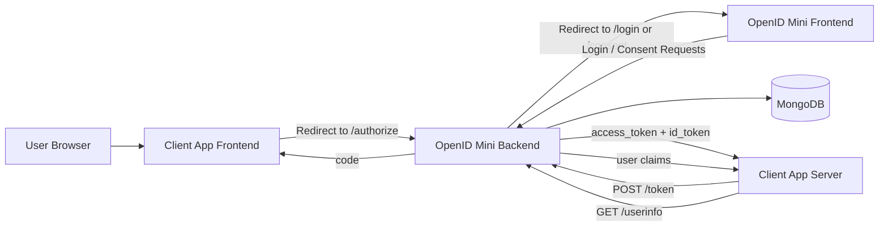
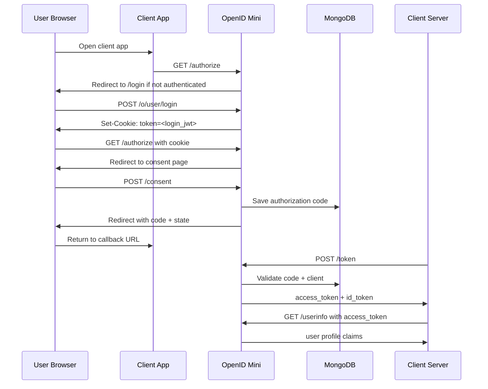

# OpenID Mini

> A learning-focused OAuth 2.0 + OpenID Connect identity provider built from scratch to understand how third-party login systems work under the hood.

[](https://nodejs.org/)
[](https://expressjs.com/)
[](https://react.dev/)
[](https://www.mongodb.com/)
[](https://oauth.net/2/)
[](https://openid.net/connect/)

## Overview

OpenID Mini is a simplified identity provider inspired by flows such as "Login with Google". It implements the core pieces of OAuth 2.0 Authorization Code Flow and adds OpenID Connect capabilities such as ID tokens, discovery metadata, and JWKS-based key verification.

The goal of the project is not to replace a production identity platform. The goal is to deeply understand:

- how client applications are registered
- how login and consent are separated
- why authorization codes exist
- why `/token` is a server-to-server exchange
- how `access_token` and `id_token` differ
- how RS256, `kid`, and JWKS are used to verify identity tokens

## What This Project Demonstrates

- OAuth 2.0 Authorization Code Flow
- OpenID Connect basics
- Client registration with `client_id` and hashed `client_secret`
- User login with HTTP-only cookie session
- Consent approval flow
- Short-lived, one-time authorization codes
- Token exchange at `/token`
- `access_token` for protected API access
- `id_token` signed with `RS256`
- `/.well-known/openid-configuration`
- `/.well-known/jwks.json`
- `/userinfo` resource endpoint
- Separate React frontend and Express backend

## Architecture



## Flow Summary



## Tech Stack

### Backend

- Node.js
- Express.js
- MongoDB
- Mongoose
- jsonwebtoken
- bcrypt
- cookie-parser

### Frontend

- React
- Vite
- Plain CSS

### Auth / Security Concepts

- OAuth 2.0 Authorization Code Flow
- OpenID Connect
- JWT
- HTTP-only cookies
- RS256
- JWKS
- Client secret hashing
- Redirect URI validation

## Project Structure

```txt
openID-mini/
├── src/
│   ├── config/
│   ├── controllers/
│   ├── middlewares/
│   ├── models/
│   ├── route/
│   └── utils/
├── frontend/
│   ├── src/
│   └── package.json
├── server.js
├── package.json
└── README.md
```

## Important Endpoints

### Auth / OAuth

- `GET /authorize`
- `POST /consent`
- `POST /token`
- `GET /userinfo`

### User

- `POST /o/user/signUp`
- `POST /o/user/login`
- `POST /o/user/logout`
- `GET /o/user/me`

### Client Registration

- `POST /o/client/signUp`

### OpenID Connect Discovery

- `GET /.well-known/openid-configuration`
- `GET /.well-known/jwks.json`

## Token Model

### Login Session Cookie

- Cookie name: `token`
- Created after user login
- Used by OpenID Mini for `/authorize` and `/consent`
- Stored as an HTTP-only browser cookie

### Authorization Code

- Saved in MongoDB
- Bound to `clientId`, `userId`, `redirectUri`, `scope`, and `expiresAt`
- Short-lived and one-time use

### Access Token

- Returned from `/token`
- Used in `Authorization: Bearer <token>`
- Protects endpoints like `/userinfo`
- Currently signed with `HS256` using `JWT_SECRET`

### ID Token

- Returned from `/token`
- Used by the client app to identify the user
- Signed using `RS256`
- Exposes `kid` in the JWT header
- Can be verified using the JWKS public key

## OpenID Connect Additions

This project goes beyond a basic OAuth demo by exposing:

- discovery metadata at `/.well-known/openid-configuration`
- public key material at `/.well-known/jwks.json`
- `RS256`-signed ID tokens
- optional certificate chain support through `x5c`

Example discovery metadata:

```json
{
  "issuer": "http://localhost:8000",
  "authorization_endpoint": "http://localhost:8000/authorize",
  "token_endpoint": "http://localhost:8000/token",
  "userinfo_endpoint": "http://localhost:8000/userinfo",
  "jwks_uri": "http://localhost:8000/.well-known/jwks.json"
}
```

## Running Locally

### 1. Install backend dependencies

```bash
npm install
```

### 2. Install frontend dependencies

```bash
cd frontend
npm install
```

### 3. Configure environment

Create a `.env` file in the project root based on `.env.example`.

Example:

```env
PORT=8000
MONGO_URI=mongodb://localhost:27017/openid-mini
JWT_SECRET=replace-with-a-long-random-secret
JWT_EXPIRY=1h
ID_TOKEN_EXPIRY=1h
ISSUER=http://localhost:8000
OIDC_KEY_ID=openid-mini-dev-key
FRONTEND_URL=http://localhost:5173
NODE_ENV=development
```

### 4. Start the backend

```bash
npm run dev
```

### 5. Start the frontend

```bash
cd frontend
npm run dev
```

Default URLs:

- Backend: `http://localhost:8000`
- Frontend: `http://localhost:5173`

## Optional Certificate / Key Setup

Generate an RSA key pair and local certificate:

```bash
openssl genpkey -algorithm RSA -out private.pem -pkeyopt rsa_keygen_bits:2048
openssl req -new -x509 -key private.pem -out cert.pem -days 365 -subj "/CN=OpenID Mini"
openssl x509 -in cert.pem -pubkey -noout > public.pem
```

If you want fixed keys in production, provide:

- `OIDC_PRIVATE_KEY`
- `OIDC_PUBLIC_KEY`
- `OIDC_CERT`
- `OIDC_KEY_ID`

## Developer Notes

- `/token` intentionally does not use `authMiddleware`
  It is a client-server token exchange, not a browser session request.
- The login cookie and the OAuth access token are different things
  The cookie maintains the OpenID Mini login session. The access token is issued after successful code exchange.
- The current frontend is a separate Vite app
  This keeps the project closer to a real-world split between auth server and UI.

## Limitations

This is a serious learning project, but it is not yet production-ready.

Current limitations include:

- no PKCE yet
- no refresh token rotation
- no token revocation endpoint
- no advanced rate limiting or abuse protection
- no audit logging
- access token still uses a shared secret instead of a dedicated signing strategy

## Roadmap

- Add PKCE for public clients
- Add refresh tokens and rotation
- Add better OAuth error responses
- Add stronger session management
- Add token revocation and logout improvements
- Separate resource server more clearly
- Add automated tests for the full auth flow

## Writing / Blog

I also write about the concepts behind the project and related JavaScript topics:

- [OAuth 2.0 + OpenID Connect From Scratch](https://openidconnect.hashnode.dev/oauth-2-openid-connect-from-scratch)

## Why This Project Matters

Most authentication projects stop at "login/signup with JWT". This one goes further by exploring the protocol-level behavior behind third-party login systems. It is designed to show practical backend understanding, not just library usage.

## Author

**Kunal Bhanuse**  
MERN Stack Developer with a strong interest in backend systems, authentication flows, and secure API design.
